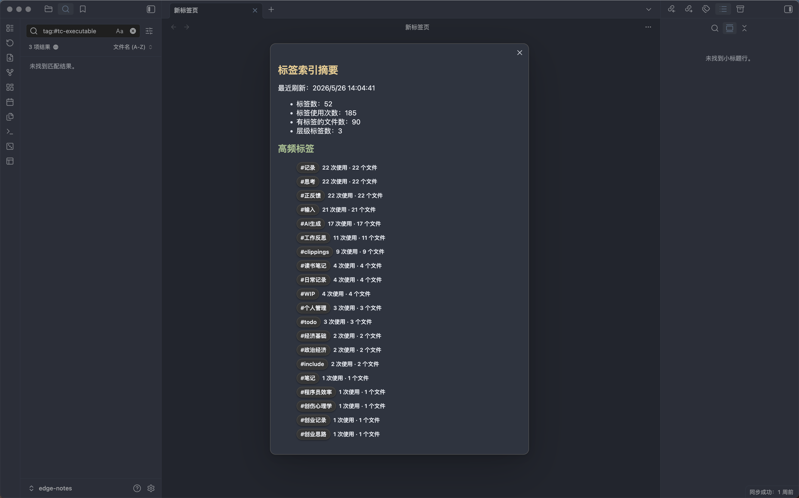
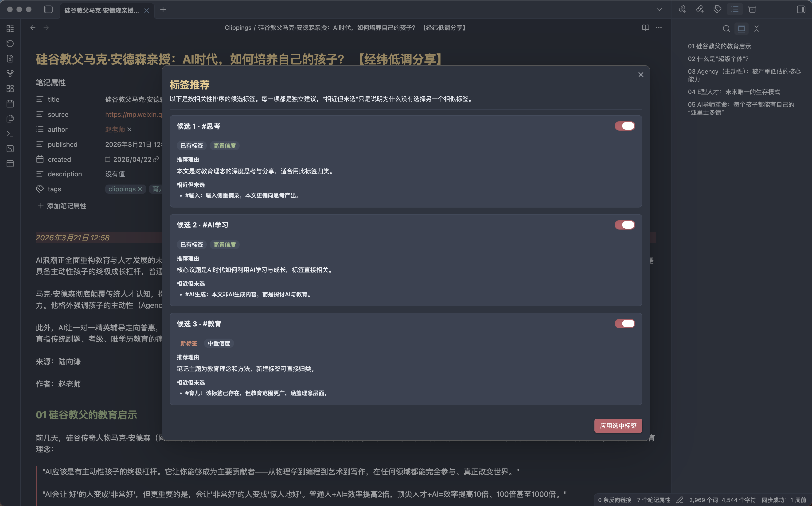
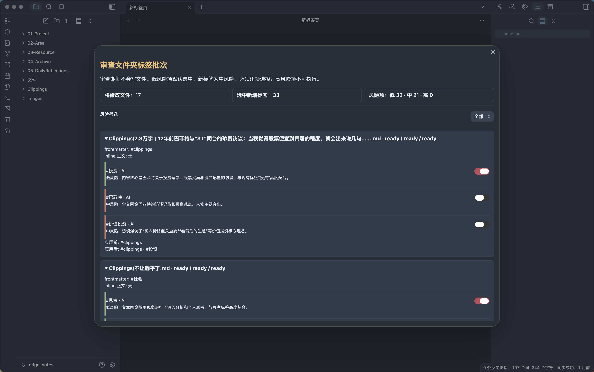
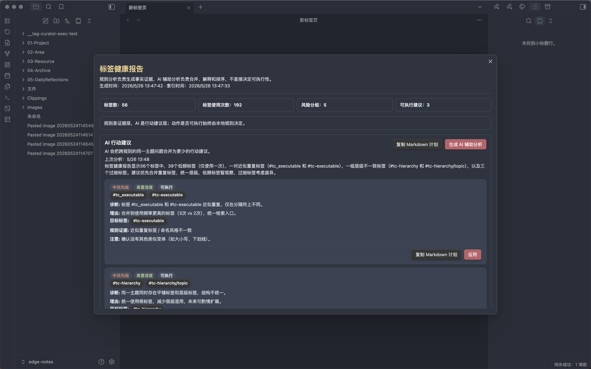
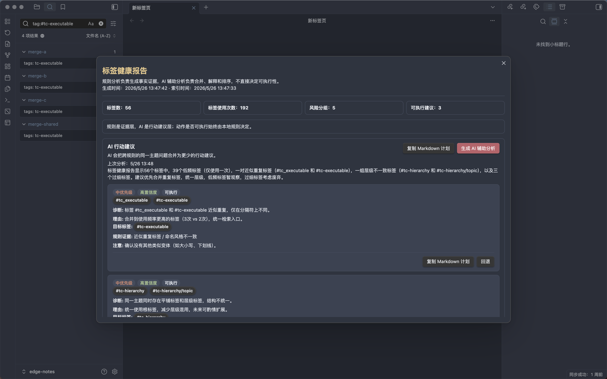
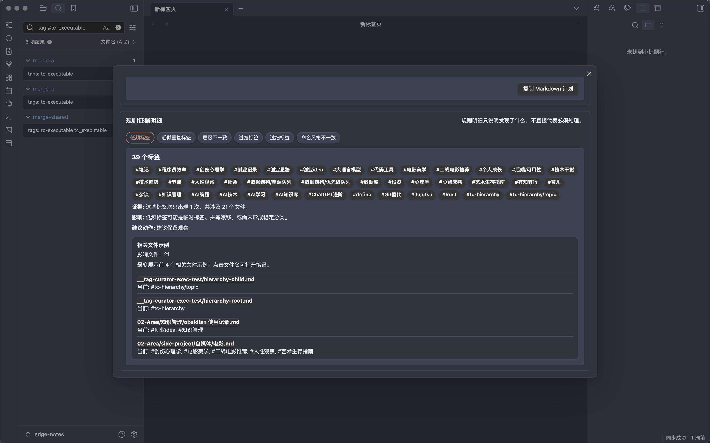
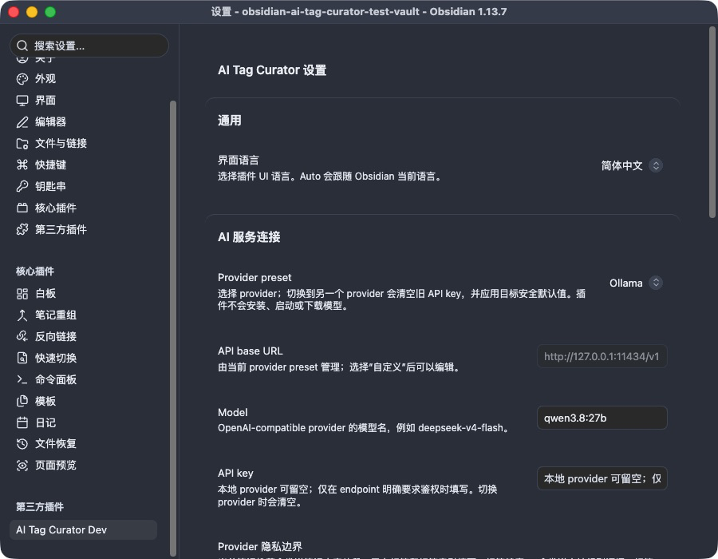
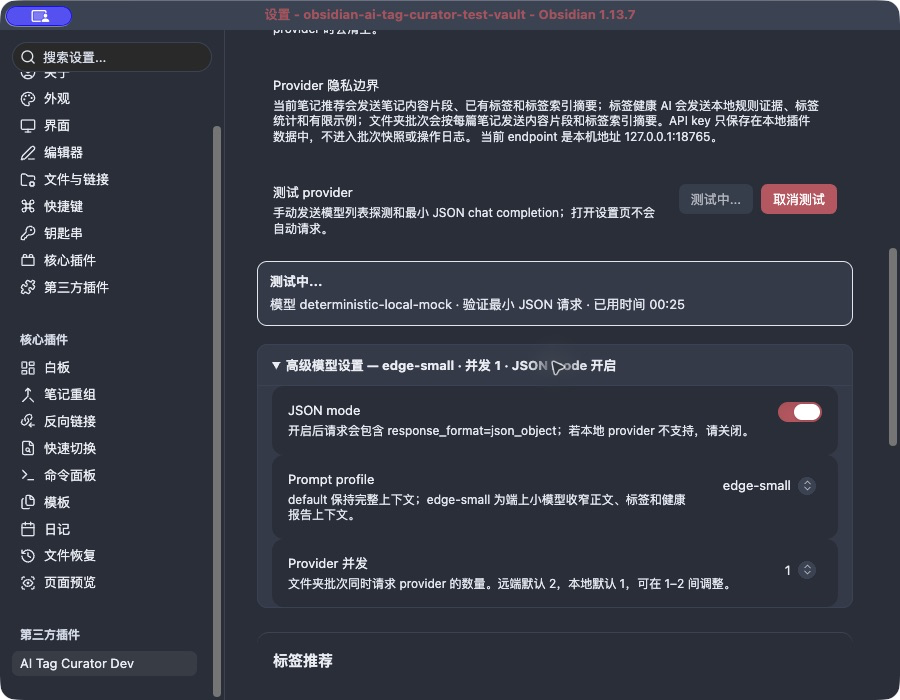

# Obsidian AI Tag Curator

[简体中文](README.zh-CN.md) | English

AI tag management and governance for Obsidian vaults.

AI Tag Curator is not a generic "generate tags for this note" plugin. It helps you keep an existing Obsidian tag taxonomy coherent by reusing known tags, explaining recommendations, and surfacing vault-level tag problems before any risky cleanup work.


## Current MVP Capabilities

**Vault tag index**

- Build a tag index from Obsidian metadata, frontmatter tags, and optional inline tags.
- Show a tag index summary with tag counts, usage counts, file counts, and top tags.
- Reuse the cached index for recommendations and health reports instead of scanning the whole vault every time.

**Current note recommendations**

- Suggest tags for the current Markdown note.
- Prefer existing vault tags, even when new tags are allowed.
- Treat frontmatter and inline body tags as one source-aware note inventory, and filter both from AI suggestions.
- Default-select inline tags that are missing from frontmatter so the formatter-facing frontmatter can represent all reviewed note tags; each item can be deselected.
- Explain each recommendation with confidence and close alternatives not selected.
- Apply selected recommendations only after user confirmation.
- Undo the latest tag change made by this plugin for the current note.
- Bind previews to a SHA-256 snapshot of the full Markdown and reject stale content before writing.
- Run slow AI requests in the background and show results when ready.

**Safe folder batch preview**



- Start from the active note's parent folder, choose any other vault folder or the vault root, and include subfolders by default.
- Confirm the full Markdown file count and estimated one-request-per-note cost before any content read, index build, or provider request.
- Enforce a configurable complete-batch limit of 1-200 files (default 50) without silently truncating the scope.
- Generate source-aware candidates with at most two concurrent AI requests; cancellation immediately stops new work, discards late results, and warns that in-flight provider requests may still be billed.
- Keep locally derived inline-to-frontmatter sync items available when AI fails, and retry only failed read/AI items.
- Review frontmatter, inline, and AI sources per file; low-risk inline/existing-tag additions start selected, new tags are medium risk and require individual selection, and destructive actions are not executable.
- Apply only after a second whole-batch confirmation, using full preflight, per-file snapshot checks, reverse compensation, and a persisted fixed recovery target if compensation is incomplete.
- Undo the latest applied folder batch as one operation, including after an Obsidian/plugin reload.
- Never rewrite note bodies or remove inline tags.

**Vault-level tag health report**
- Organize vault-level tag health into overview, AI priority actions, and rule evidence details.
- Group health issues such as low-frequency tags, near duplicates, hierarchy inconsistencies, over-broad tags, over-narrow tags, and naming drift.
- Use rule analysis for factual evidence and action safety boundaries; use AI assistance for merging related issues, explaining rationale, ranking priorities, and adding risk notes.
- Show user-facing AI action cards with priority, confidence, actionability, diagnosis, rationale, target tags, rule evidence, and caution notes.
- Cache AI-enhanced analysis for the current tag index and show the last analysis time when reopening the report.
- Executable merge/rename suggestions can show file previews, be applied manually, and be undone. Observation, broad split, deprecation, and removal suggestions stay read-only or manual-review.
- Copy AI action and cleanup suggestions as Markdown for external review.
- Click health report tags to copy and search them in Obsidian.
- Keep long reports scrollable inside a stable modal layout.





**Settings**


- Support remote OpenAI-compatible providers such as DeepSeek and OpenAI, plus local OpenAI-compatible endpoints such as Ollama, LM Studio, and LiteRT-LM CLI.
- Local providers may leave the API key blank, disable JSON mode, and default to the smaller `edge-small` prompt profile with one concurrent folder-batch request.
- Group settings into General, AI service connection, Advanced model settings, Tag recommendations, Indexing and batch, and Diagnostics and feedback; advanced model settings are collapsed by default.
- Provide an explicit provider test with persistent stage and elapsed-time feedback, cancellation, late-result isolation, and a disclosure of which content the current endpoint receives.
- Show dev-mode timing for tag recommendations and AI-enhanced health analysis.
- Support Chinese, English, and `Auto` language mode following Obsidian.
- Configure the maximum complete folder batch size from 1 to 200 files.

## Provider Configuration

Choose a `Provider preset` first, then configure as needed:

- `Provider type` (shown only for the `Custom` preset)
- `API base URL` (read-only for standard presets and editable for `Custom`)
- `API key` (required for remote providers, optional for local providers)
- `Model`
- `JSON mode`
- `Prompt profile`
- `Provider concurrency`

Example OpenAI-compatible settings:

| Provider | Type | API base URL | API key | Model example |
| --- | --- | --- | --- | --- |
| OpenAI | Remote | `https://api.openai.com/v1` | Required | `gpt-4o-mini` |
| DeepSeek | Remote | `https://api.deepseek.com` | Required | `deepseek-chat` |
| Ollama | Local | `http://127.0.0.1:11434/v1` | Optional | `qwen3.8:27b` |
| LM Studio | Local | `http://127.0.0.1:1234/v1` | Optional | The locally loaded model name |
| LiteRT-LM CLI | Local | `http://127.0.0.1:9379/v1` | Optional | The model exposed by `litert-lm serve` |

The API key is stored locally in Obsidian plugin data and is not written into folder-batch snapshots or operation logs. The plugin does not install, start, download, or manage local models. If a local endpoint is not `127.0.0.1` / `localhost`, settings and folder-scope confirmation warn that content is sent to that address.

Apple Foundation Models, Android Gemini Nano/AICore, Chrome Prompt API, and LiteRT-LM JS are not bundled directly into the Obsidian plugin runtime. This stage only connects through an explicit local OpenAI-compatible endpoint. See the Chinese [on-device model support research](docs/on-device-model-support-research.zh-CN.md).

### Ollama + Qwen3.8 quick start

This path was validated on an Apple M2 Pro with 32GB unified memory using Ollama `0.32.15` and the approximately 17GB `qwen3.8:27b` model. Choose a smaller model on machines with less available memory.

1. Install and start Ollama:

```bash
brew install --cask ollama-app
ollama --version
```

Launch the Ollama app. When you need to run the service manually, use `ollama serve`.

2. Download and confirm the model:

```bash
ollama pull qwen3.8:27b
ollama list
```

3. Verify the native and OpenAI-compatible APIs:

```bash
curl -fsS http://127.0.0.1:11434/api/version
curl -fsS http://127.0.0.1:11434/v1/models
curl -fsS http://127.0.0.1:11434/v1/chat/completions \
  -H 'Content-Type: application/json' \
  -d '{"model":"qwen3.8:27b","messages":[{"role":"user","content":"Return exactly {\"ok\":true} as JSON."}],"stream":false}'
```

4. In the plugin's **AI service connection** group, select:

- Provider preset: `Ollama`
- API base URL: `http://127.0.0.1:11434/v1` (managed by the preset)
- Model: `qwen3.8:27b`
- API key: blank
- Advanced model settings: `edge-small`, concurrency `1`; JSON mode starts off and can be enabled after a successful compatibility test
- Click **Test connection** and keep the settings page open for the persistent stage, elapsed time, and final result

Switching providers clears the previous API key and applies safe destination defaults. Local model tests and recommendations may take several minutes. Cancelling discards late UI results, but a request already sent to Ollama may continue inference until it settles.

### Capability boundary

The plugin currently uses text `chat/completions` and requires parseable structured JSON. Even when Ollama, LocalAI, or another runtime supports more, the plugin does not currently call vision, image generation, speech, embeddings, tools/agents, streaming, or native Apple/Google on-device SDKs.

### Troubleshooting

- Endpoint unreachable: confirm Ollama is running, then check `lsof -nP -iTCP:11434 -sTCP:LISTEN` and `/api/version`.
- Model 404: run `ollama list` and use the exact model name in plugin settings.
- JSON mode / `response_format` incompatibility: expand **Advanced model settings**, turn JSON mode off, and test again.
- Non-JSON response: keep `edge-small`, confirm the model follows structured-output instructions, or choose a model with stronger instruction following.
- Slow inference: run `ollama ps`, avoid keeping multiple large models resident, reduce batch concurrency, or use a smaller model.

## Local Installation

1. Install dependencies:

```bash
npm install
```

2. Build the plugin:

```bash
npm run build
```

3. Create a plugin directory in your target Obsidian vault:

```bash
mkdir -p /path/to/your-vault/.obsidian/plugins/ai-tag-curator
```

4. Copy the generated files:

```bash
cp main.js manifest.json styles.css .hotreload /path/to/your-vault/.obsidian/plugins/ai-tag-curator/
```

5. Open Obsidian, go to `Settings -> Community plugins`, and enable `AI Tag Curator`.

Generated plugin files:

- `main.js`
- `manifest.json`
- `styles.css`
- `.hotreload` for local development with the [Hot Reload](https://github.com/pjeby/hot-reload) plugin

For local development, you can install directly into an Obsidian vault:

```bash
OBSIDIAN_VAULT_PATH=/path/to/your-vault npm run local:install
```

To install a side-by-side development copy without replacing the Marketplace plugin:

```bash
OBSIDIAN_VAULT_PATH=/path/to/your-vault npm run local:install-dev
```

The install script requires an explicit `OBSIDIAN_VAULT_PATH` so it cannot silently write to the wrong or unregistered Obsidian vault.

### Release screenshot vault

Prepare or reset the dedicated synthetic vault used for real Obsidian smoke tests and release screenshots:

```bash
npm run release:vault:prepare
```

The default vault is `/Users/edge/work/obsidian-ai-tag-curator-test-vault`. The command copies only the active appearance configuration and theme from `/Users/edge/personal/edge-notes`, installs the development plugin, resets the synthetic release notes, and disables Obsidian Sync. Override either path when needed:

```bash
OBSIDIAN_RELEASE_VAULT_PATH=/path/to/test-vault \
OBSIDIAN_THEME_SOURCE_VAULT=/path/to/theme-source \
npm run release:vault:prepare
```

Start the deterministic local provider before exercising AI-backed release flows:

```bash
npm run release:mock
```

The mock listens on `127.0.0.1:18765`, keeps external APIs and real credentials out of the screenshot workflow, and adds a short response delay so progress and cancellation states can be verified.

## Usage

1. Configure provider type, preset, API base URL, API key (blank is allowed for local providers), and model.
2. Run `Refresh vault tag index`.
3. Open a Markdown note.
4. Run `Suggest tags for current note`.
5. Review the recommendation modal and apply only the tags you want.
6. Run `Generate tag suggestions for folder` to confirm a folder scope, generate candidates, and review a whole batch before writing.
7. Run `Undo latest folder batch tag operation` to revert the latest applied folder batch as one unit.
8. Run `Analyze tag health` to inspect vault-level tag problems.
9. Optionally run `AI-enhanced analysis` inside the health report.
10. Run `Undo last tag curator change` if you need to revert the latest tag write for the current note.

## Commands

The plugin UI defaults to `Auto`, which follows the current Obsidian language. In English, the commands are:

- `Refresh vault tag index`
- `Show tag index summary`
- `Analyze tag health`
- `Suggest tags for current note`
- `Generate tag suggestions for folder`
- `Undo last tag curator change`
- `Undo latest folder batch tag operation`

## Development

Run tests:

```bash
npm test
```

Build:

```bash
npm run build
```

OpenSpec workflow:

```bash
npm run spec:list
npm run spec:status -- --change <change-name>
npm run spec:validate -- <change-name>
```

For new product work, start with an OpenSpec change proposal before implementation.

## Current Limitations

- Current-note and folder workflows write only the frontmatter `tags` field. Reviewed inline tags can be copied into frontmatter, but their original body text and position are never rewritten or removed.
- Remote providers still require an API key. Local OpenAI-compatible providers may leave it blank, but still require a base URL and model.
- The plugin only calls the explicitly configured provider endpoint. It does not install, start, or download models, and it does not silently fall back to a cloud provider.
- A folder batch must contain 1-200 Markdown files within the configured limit; an oversized scope is blocked rather than truncated.
- Cancellation cannot revoke provider requests already sent, so those in-flight requests may still be billed even though late results are discarded.
- Only additive tag plans are executable in folder batches. Delete, replace, merge, and body-edit actions remain outside the 0.3 write boundary.
- Rule evidence in tag health reports is read-only. Executable cleanup items require file previews and explicit manual confirmation.
- AI-enhanced health analysis provides summary and action guidance only; it cannot change local action capability or execute changes.
- Cleanup plans label action capabilities. Executable merge/rename items can be applied manually and undone; other items remain preview-only, observe-only, or manual-review.
- AI responses must be valid structured JSON. If parsing fails, no file is modified.

## Documentation

- [Changelog](CHANGELOG.md)
- [License](LICENSE)
- [Chinese release checklist](docs/release-checklist.zh-CN.md)
- [English product handoff](docs/product-handoff.md)
- [Chinese product explanation](docs/product-handoff.zh-CN.md)
- [Chinese technical design](docs/technical-design.zh-CN.md)
- [Chinese roadmap](docs/roadmap.zh-CN.md)
- [OpenSpec project context](openspec/project.md)
