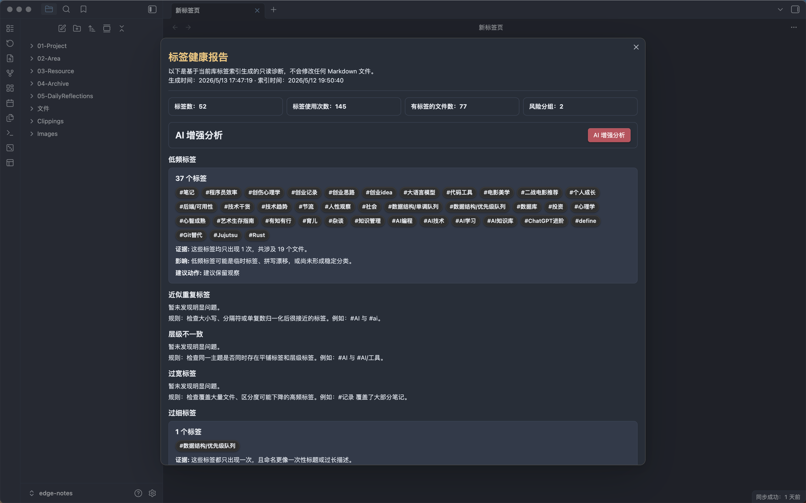
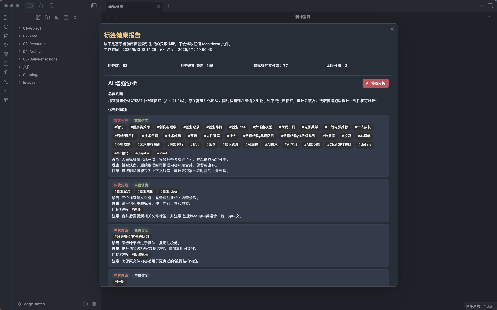

# Obsidian AI Tag Curator

简体中文 | [English](README.md)

面向 Obsidian 库的 AI 标签管理与治理插件。

AI Tag Curator 不是普通的“给当前笔记生成几个标签”的插件。它更像一个标签体系整理助手：优先复用已有标签，解释推荐理由，并在真正进入高风险清理前，先帮你看清整个库的标签问题。


## 当前 MVP 能力

**库标签索引**

- 从 Obsidian metadata、frontmatter tags 和可选 inline tags 构建标签索引。
- 展示标签索引摘要，包括标签数、使用次数、文件数和高频标签。
- 推荐和健康报告会复用缓存索引，避免每次都全库扫描。

**当前笔记标签推荐**

- 为当前 Markdown 笔记推荐标签。
- 即使允许新标签，也优先复用库中已有标签。
- 自动过滤当前笔记已经拥有的标签，避免重复推荐。
- 为每个推荐给出理由、置信度和相近但未选标签。
- 写入前必须由用户确认。
- 支持撤销本插件对当前笔记最近一次标签修改。
- 慢速 AI 请求后台执行，完成后再弹出结果。

**库级标签健康报告**


- 生成只读的库级标签健康报告。
- 识别低频标签、近似重复标签、层级不一致、过宽标签、过细标签和命名风格漂移等问题。
- 为每组问题展示证据、影响和建议动作。
- 健康报告中的标签支持点击复制并搜索。
- 支持 AI 增强健康分析，输出总体判断和优先处理项。


**设置**

- 支持 DeepSeek、OpenAI 等 OpenAI-compatible provider。
- 支持中文、英文和跟随 Obsidian 当前语言的 `Auto` 模式。
- 开发模式支持展示标签推荐和 AI 增强分析的总耗时与阶段耗时。

## Provider 配置

在插件设置中配置：

- `API base URL`
- `API key`
- `Model`

常见 OpenAI-compatible 配置示例：

| Provider | API base URL | Model 示例 |
| --- | --- | --- |
| DeepSeek | `https://api.deepseek.com` | `deepseek-v4-flash` |
| OpenAI | `https://api.openai.com/v1` | `gpt-4o-mini` |

API key 会保存在本地 Obsidian 插件数据中。

## 本地安装

1. 安装依赖：

```bash
npm install
```

2. 构建插件：

```bash
npm run build
```

3. 在目标 Obsidian 库中创建插件目录：

```bash
mkdir -p /path/to/your-vault/.obsidian/plugins/ai-tag-curator
```

4. 复制构建产物：

```bash
cp main.js manifest.json styles.css .hotreload /path/to/your-vault/.obsidian/plugins/ai-tag-curator/
```

5. 打开 Obsidian，进入 `Settings -> Community plugins`，启用 `AI Tag Curator`。

构建产物包括：

- `main.js`
- `manifest.json`
- `styles.css`
- `.hotreload`，用于配合 [Hot Reload](https://github.com/pjeby/hot-reload) 插件进行本地开发

## 使用流程

1. 配置 OpenAI-compatible API base URL、API key 和 model。
2. 执行 `刷新标签索引`。
3. 打开一篇 Markdown 笔记。
4. 执行 `为当前笔记推荐标签`。
5. 在推荐弹窗中检查结果，只应用想保留的标签。
6. 执行 `分析标签健康度` 查看库级标签问题。
7. 可在健康报告中执行 `AI 增强分析`。
8. 如需回退当前笔记最近一次标签写入，执行 `撤销当前笔记最近标签修改`。

## 插件命令

插件界面语言默认是 `Auto`，会跟随 Obsidian 当前语言。中文界面下的命令是：

- `刷新标签索引`
- `查看标签索引摘要`
- `分析标签健康度`
- `为当前笔记推荐标签`
- `撤销当前笔记最近标签修改`

## 开发

运行测试：

```bash
npm test
```

构建：

```bash
npm run build
```

OpenSpec 工作流：

```bash
npm run spec:list
npm run spec:status -- --change add-readonly-cleanup-plan
npm run spec:validate -- add-readonly-cleanup-plan
```

后续产品功能先创建 OpenSpec change proposal，再进入实现。

## 当前限制

- MVP 只写入当前笔记的 frontmatter `tags`。
- inline tags 会被读取用于索引，但不会被自动改写。
- 标签健康报告是只读诊断。
- AI 增强健康分析只输出总体判断和优先处理项。
- 清理计划目前是只读预览；批量预览、批量写入和批量撤销还没有实现。
- AI 返回内容必须是结构化 JSON，解析失败时不会修改任何文件。

## 文档

- [更新日志](CHANGELOG.md)
- [许可证](LICENSE)
- [Obsidian 插件市场发布清单](docs/release-checklist.zh-CN.md)
- [英文产品交接文档](docs/product-handoff.md)
- [中文产品说明](docs/product-handoff.zh-CN.md)
- [中文技术方案](docs/technical-design.zh-CN.md)
- [中文路线图](docs/roadmap.zh-CN.md)
- [OpenSpec 项目上下文](openspec/project.md)
