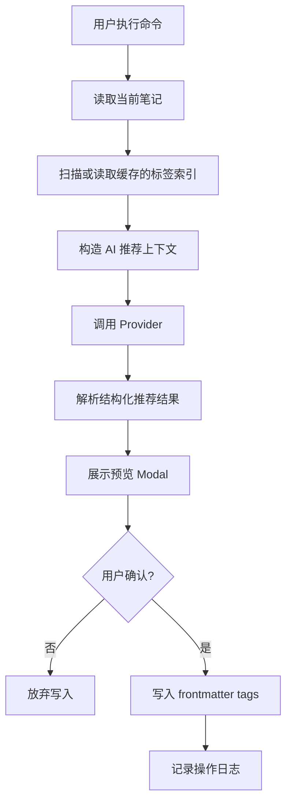

# Obsidian AI Tag Curator 中文技术方案

更新日期：2026-05-11

## 1. 目标

本技术方案面向第一版 Obsidian 插件实现。产品目标不是做一个普通的“AI 自动打标签”工具，而是做一个可解释、可预览、可撤销的 **AI 标签治理插件**。

第一版应优先证明四件事：

- 能可靠扫描 vault 中已有标签，并建立可查询的标签索引；
- 能为当前笔记推荐标签，并优先复用已有标签；
- 能解释推荐理由，尤其是为什么选择某个已有标签而不是相似标签；
- 能在写入前提供清晰预览，避免静默修改用户文件。

## 2. MVP 范围

第一阶段建议只做当前笔记闭环，不立即做复杂批量修改。

纳入 MVP：

- Obsidian 插件基础骨架；
- vault 标签扫描；
- frontmatter tags 与 inline tags 读取；
- 标签使用索引；
- 当前笔记标签推荐命令；
- AI provider 抽象；
- 推荐结果预览；
- 将确认后的标签写入当前笔记 frontmatter；
- 当前笔记级别的操作日志。

暂不纳入 MVP：

- 全 vault 自动批量改写；
- embedding 向量索引；
- 标签图谱可视化；
- 多用户同步；
- 云端账号体系；
- 复杂规则引擎。

这些能力可以在当前笔记闭环稳定后逐步加入。

## 3. 技术选型

建议采用 Obsidian 官方插件常见技术栈：

- 语言：TypeScript；
- 运行环境：Obsidian desktop plugin；
- 构建：esbuild；
- UI：Obsidian Plugin API 原生 Modal、SettingTab、Command、Notice；
- frontmatter 解析与写入：优先使用 Obsidian `processFrontMatter`，必要时再补充 YAML parser；
- AI 调用：先支持 OpenAI-compatible Chat Completions API；
- 本地存储：插件数据目录中的 JSON 文件，通过 `loadData` / `saveData` 管理配置和轻量日志。

第一版不建议引入 React。Obsidian 原生 UI 已能覆盖设置页、预览弹窗和命令交互，依赖更少，插件体积更小，也更符合 Obsidian 插件生态。

## 4. 总体架构

系统可以分为五层：

1. Obsidian 入口层：注册命令、设置页、事件监听和生命周期。
2. Vault 读取层：读取 Markdown 文件、frontmatter、inline tags 和当前编辑器内容。
3. 标签索引层：维护标签 usage、来源文件、上下文片段、命名特征。
4. AI 推荐层：基于当前笔记和标签索引生成可解释推荐。
5. 预览写入层：展示推荐、生成变更计划、确认后安全写入并记录日志。

数据流：



## 5. 建议项目结构

建议第一版项目结构如下：

```text
tag_curator/
  README.md
  manifest.json
  package.json
  tsconfig.json
  esbuild.config.mjs
  styles.css
  docs/
    product-handoff.md
    product-handoff.zh-CN.md
    technical-design.zh-CN.md
  src/
    main.ts
    settings/
      PluginSettings.ts
      SettingsTab.ts
    obsidian/
      VaultReader.ts
      FrontmatterWriter.ts
      TagParser.ts
      MarkdownSnippetExtractor.ts
    index/
      TagIndex.ts
      TagIndexBuilder.ts
      TagIndexCache.ts
    ai/
      AiProvider.ts
      OpenAICompatibleProvider.ts
      PromptBuilder.ts
      RecommendationSchema.ts
      RecommendationParser.ts
    recommendations/
      TagRecommendationService.ts
      TagRecommendationRanker.ts
      RecommendationExplainer.ts
    preview/
      RecommendationModal.ts
      ChangePlan.ts
      DiffFormatter.ts
    operations/
      OperationLog.ts
      UndoService.ts
    utils/
      normalizeTag.ts
      errors.ts
      logger.ts
  tests/
    tag-parser.test.ts
    tag-index-builder.test.ts
    recommendation-parser.test.ts
    frontmatter-writer.test.ts
```

### 核心目录说明

`src/main.ts`

- 插件入口；
- 注册命令；
- 初始化设置页；
- 管理生命周期；
- 组合各服务。

`src/settings/`

- 保存 provider、API key、模型、严格程度、新标签策略等配置；
- 设置项必须尽量明确，让用户理解“优先已有标签”和“允许新标签”的差异。

`src/obsidian/`

- 封装 Obsidian API；
- 负责读取 vault 文件、解析当前笔记、写入 frontmatter；
- 避免业务逻辑直接散落在 `main.ts`。

`src/index/`

- 构建标签索引；
- 统计标签使用次数、来源文件、代表性上下文；
- 后续可扩展缓存失效、增量更新、审计分析。

`src/ai/`

- 抽象不同 AI provider；
- 负责 prompt 组装、API 调用、结构化结果解析；
- 第一版支持 OpenAI-compatible API，后续扩展 Ollama、本地模型或其他 provider。

`src/recommendations/`

- 当前笔记推荐的业务中心；
- 输入当前笔记、标签索引、用户设置；
- 输出结构化推荐结果和解释。

`src/preview/`

- 展示推荐结果；
- 呈现新增、保留、忽略标签；
- 展示风险和说明；
- 只在用户确认后生成写入计划。

`src/operations/`

- 记录每次写入前后的标签状态；
- 支持当前笔记级别撤销；
- 后续可扩展到批量操作日志。

## 6. 关键数据模型

### 标签索引

```ts
export interface TagIndex {
  updatedAt: string;
  tags: Record<string, TagUsage>;
}

export interface TagUsage {
  tag: string;
  normalized: string;
  count: number;
  files: TagFileUsage[];
  examples: TagExample[];
  namingSignals: TagNamingSignals;
}
```

### 推荐结果

```ts
export interface TagRecommendation {
  tag: string;
  type: "existing" | "new";
  confidence: "high" | "medium" | "low";
  reason: string;
  rejectedSimilarTags?: RejectedTag[];
}

export interface RecommendationResult {
  notePath: string;
  existingTags: string[];
  recommendations: TagRecommendation[];
  warnings: string[];
}
```

### 变更计划

```ts
export interface ChangePlan {
  notePath: string;
  beforeTags: string[];
  afterTags: string[];
  addedTags: string[];
  unchangedTags: string[];
  skippedTags: string[];
  createdAt: string;
}
```

## 7. 标签读取策略

第一版建议同时读取两类标签：

- frontmatter 中的 `tags`；
- Markdown 正文中的 inline tags，例如 `#project/ai`。

写入策略则更保守：

- 默认只写入 frontmatter `tags`；
- 不主动修改正文中的 inline tags；
- 推荐结果中可以提示正文已有 inline tag，但不做自动迁移。

这样可以覆盖用户实际 vault 中常见标签来源，同时降低写入风险。

## 8. 标签规范化规则

索引层应保留原始标签，同时计算 normalized tag，用于发现近似重复和匹配。

建议规范化规则：

- 去掉开头的 `#`；
- 去除首尾空白；
- 统一连续空格为单个 `-`；
- 保留 `/` 层级；
- 比较时默认大小写不敏感；
- 不在第一版自动做中英文翻译合并。

注意：规范化用于比较，不等于写回文件。写回时应保留用户确认后的显示形式。

## 9. AI 推荐策略

### Prompt 输入

AI 推荐应包含：

- 当前笔记标题；
- 当前笔记正文摘要或截断内容；
- 当前笔记已有标签；
- vault 中高频标签；
- 与当前笔记可能相关的已有标签及代表性片段；
- 用户的新标签严格程度；
- 输出 JSON schema 要求。

### 推荐原则

模型必须遵守：

- 优先推荐 existing tags；
- 只有在 existing tags 无法表达主题时才推荐 new tags；
- 每个推荐必须给出简短理由；
- 如果存在相似标签，必须解释为什么选择当前标签；
- 不得输出无法解析的自由文本。

### 结构化输出

Provider 层只接受结构化 JSON。解析失败时应提示用户重试，而不是猜测模型意图后直接写入。

## 10. 预览与写入

推荐结果必须经过预览 Modal：

- 显示当前已有标签；
- 显示建议新增标签；
- 标记 existing / new；
- 显示 confidence；
- 显示推荐理由；
- 允许用户取消勾选某些标签；
- 点击确认后才写入。

写入规则：

- 使用 Obsidian `processFrontMatter` 修改当前文件；
- 如果没有 frontmatter，则创建；
- 保留已有标签；
- 避免重复标签；
- 写入前构造 `ChangePlan`；
- 写入后记录 `OperationLog`。

## 11. 配置项

第一版建议提供这些设置：

- API base URL；
- API key；
- model；
- 推荐数量上限；
- 是否允许新标签；
- 新标签严格程度：strict / balanced / exploratory；
- 是否读取 inline tags；
- 标签索引刷新方式：手动刷新 / 打开 vault 时刷新；
- 操作日志保留条数。

默认策略应偏保守：

- 允许读取 inline tags；
- 默认推荐已有标签；
- 默认不主动创建新标签，或将新标签标记为需要用户额外确认；
- 默认只在当前笔记确认后写入。

## 12. 错误处理

需要覆盖的主要错误：

- API key 未配置；
- provider 请求失败；
- AI 返回非 JSON；
- 当前文件不是 Markdown；
- 当前笔记为空；
- vault 标签索引为空；
- frontmatter 写入失败；
- 写入期间文件已被外部修改。

用户提示原则：

- 错误消息要说明发生了什么；
- 不暴露完整 API key；
- 不在失败时写入任何部分结果；
- 对可重试错误给出重试入口。

## 13. 性能策略

第一版可以采用手动或按需索引：

- 插件加载时不强制扫描整个大型 vault；
- 用户首次执行推荐时，如果没有索引，则构建索引；
- 索引结果缓存到插件数据；
- 后续通过命令手动刷新；
- 每个标签只保留少量代表性片段，避免 prompt 过大；
- 对大 vault 显示扫描进度。

后续版本再考虑文件变更监听和增量更新。

## 14. 测试策略

单元测试重点：

- frontmatter tags 解析；
- inline tags 解析；
- 标签规范化；
- 标签索引统计；
- AI JSON 结果解析；
- ChangePlan 生成；
- frontmatter 写入边界。

集成验证重点：

- 在测试 vault 中安装插件；
- 运行当前笔记推荐；
- 检查推荐预览；
- 确认写入后 Markdown frontmatter 正确；
- 撤销后恢复原标签；
- API 请求失败时不写入文件。

## 15. 分阶段实施计划

### 阶段一：插件骨架与标签索引

- 初始化 Obsidian 插件项目；
- 注册基础命令；
- 实现设置页；
- 实现 Markdown 文件扫描；
- 建立标签使用索引；
- 添加索引刷新命令。

交付标准：能在 Obsidian 中运行插件，并输出当前 vault 的标签统计。

### 阶段二：当前笔记推荐

- 实现当前笔记读取；
- 实现 PromptBuilder；
- 实现 OpenAI-compatible Provider；
- 实现 RecommendationParser；
- 展示推荐结果 Modal。

交付标准：用户能看到当前笔记的可解释标签建议，但还不写入文件。

### 阶段三：安全写入与撤销

- 实现 ChangePlan；
- 用 `processFrontMatter` 写入标签；
- 记录 OperationLog；
- 支持撤销最近一次当前笔记标签变更。

交付标准：用户确认后才写入，且可以撤销最近一次操作。

### 阶段四：标签健康报告

- 识别重复或近似标签；
- 识别单次使用标签；
- 识别命名不一致；
- 输出只读报告。

交付标准：用户能看到 vault 标签体系中的真实问题，但插件仍不自动批量改写。

### 阶段五：文件夹批量预览

- 选择文件夹；
- 批量生成 ChangePlan；
- 按风险分组；
- 支持逐条确认；
- 支持批量撤销。

交付标准：批量能力建立在明确预览和可撤销日志之上。

## 16. 风险与应对

### 与竞品同质化

风险：用户认为这只是另一个 AI 标签生成器。

应对：优先实现标签索引、已有标签复用、解释、预览和审计，而不是堆更多生成能力。

### AI 输出不稳定

风险：模型返回不可解析结果或推荐噪音标签。

应对：强制 JSON schema，解析失败不写入；默认保守推荐已有标签；新标签需要额外确认。

### 用户不信任写入

风险：用户害怕插件修改个人 Markdown 文件。

应对：写入前预览，写入后记录日志，支持撤销；第一版只改当前笔记。

### 大 vault 性能问题

风险：扫描大 vault 阻塞 Obsidian。

应对：按需扫描、缓存索引、限制代表性片段数量，后续再做增量更新。

## 17. 第一版验收标准

第一版可以认为完成，如果满足：

- 插件能在 Obsidian 中加载；
- 能扫描 vault 并统计 frontmatter / inline tags；
- 能为当前 Markdown 笔记生成推荐；
- 推荐中 existing tags 优先；
- 每个推荐都有理由和置信度；
- 用户确认前不会写入；
- 写入只影响当前笔记 frontmatter；
- 最近一次写入可以撤销；
- 常见错误不会产生部分写入。
